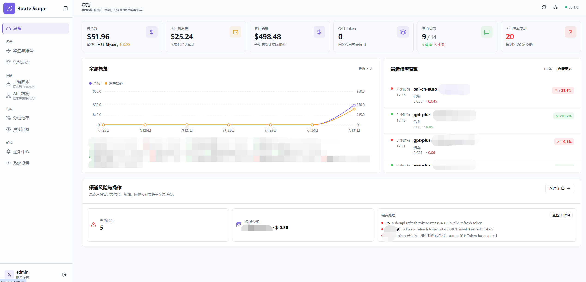
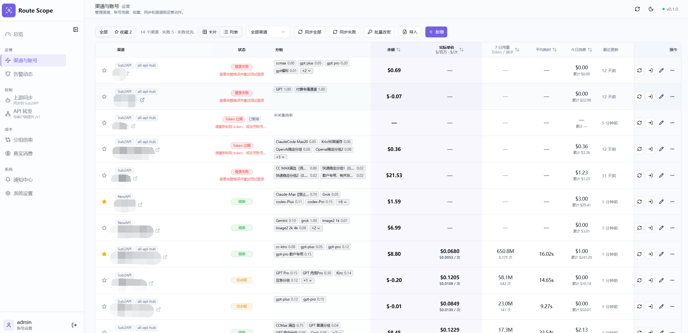
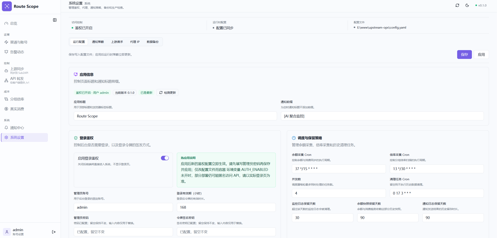
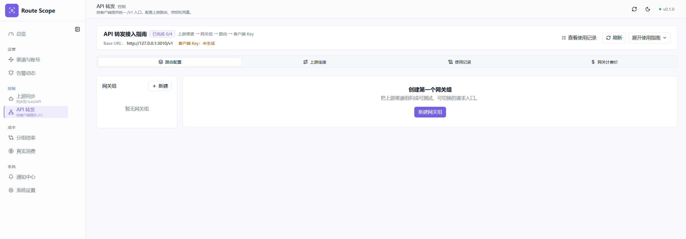
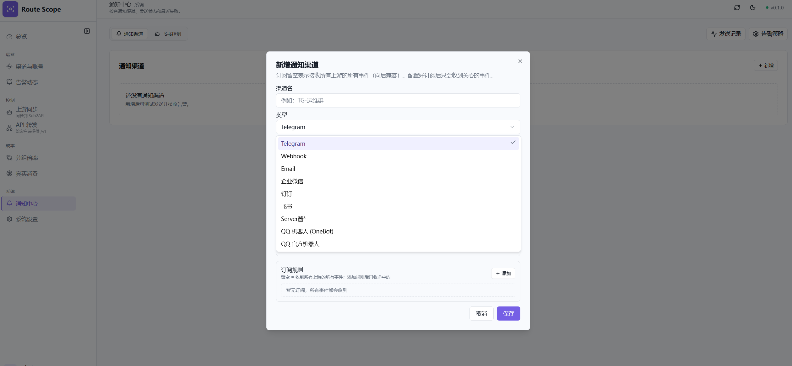
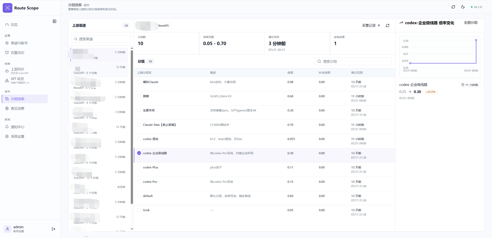
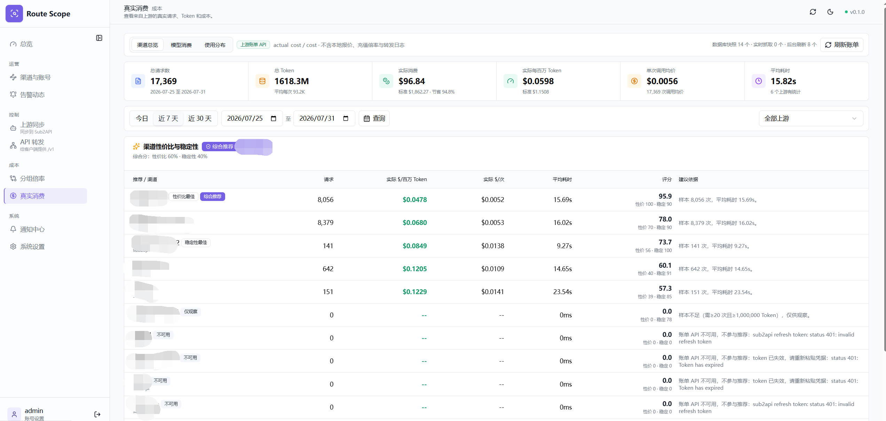

# RouteScope

[中文说明](README.zh.md) | [Repository](https://github.com/owen891/RouteScope)

> RouteScope is a self-hosted operations console for monitoring upstream channels, comparing rates and costs, synchronizing Sub2API accounts, and serving a controlled API relay from one workspace.

**Current version: v0.1.0**

RouteScope is built for a single trusted operator. It brings upstream status, operational history, routing configuration, notifications, and runtime settings into one local control plane. The primary deployment is Docker Compose with SQLite and a persistent <code>./data</code> directory.

## What It Does

- **Overview**: summarizes channel health, balances, costs, recent collection facts, and operational risks.
- **Channels and accounts**: manages NewAPI and Sub2API channels, credentials, monitoring state, favorites, API keys, recharge, redeem, and account checks.
- **Activity**: brings alerts, upstream announcements, collection facts, and health probes into one timeline.
- **Group rates**: compares each upstream group's current rate and rate-change history.
- **Upstream sync**: synchronizes selected channel accounts to Sub2API targets with groups, proxies, model limits, rate conversion, execution logs, and controlled remote actions.
- **API relay**: exposes a unified <code>/v1</code> gateway with model mapping, weighted routing, protocol conversion, failover, access keys, direct providers, and usage records.
- **Actual costs**: shows upstream request usage, token counts, latency, and cost estimates from collected data and relay traffic.
- **Notification center**: configures notification channels, subscriptions, cooldowns, retry behavior, and delivery history.
- **System settings**: controls admin authentication, proxy, schedules, retention, backup checks, Captcha providers, version checks, and hot-reloadable runtime settings.

## Screenshots

## Quick Start

### Docker Compose with SQLite

1. Create the local environment file:

   ~~~bash
   cp .env.example .env
   ~~~

2. Set a stable application secret and enable admin login in <code>.env</code>:

   ~~~env
   APP_SECRET=replace-with-a-random-string-at-least-32-bytes
   AUTH_ENABLED=true
   ADMIN_USERNAME=admin
   ADMIN_PASSWORD=replace-with-a-strong-password
   ~~~

3. Start RouteScope:

   ~~~bash
   docker compose up -d
   ~~~

4. Open <code>http://localhost:8080</code> and sign in with the configured admin account.

The image is pulled from <code>ghcr.io/owen891/routescope</code>. Change the host port with <code>HTTP_PORT</code>. SQLite data and runtime configuration are stored under <code>./data</code>:

~~~text
data/upstream-ops.db
data/config.yaml
~~~

Pin a release instead of using <code>latest</code>:

~~~env
IMAGE_TAG=v0.1.0
~~~

### Optional MySQL

Use the MySQL overlay when required:

~~~bash
docker compose -f docker-compose.yml -f docker-compose.mysql.yml up -d
~~~

Set <code>APP_SECRET</code>, <code>MYSQL_DATABASE</code>, <code>MYSQL_USER</code>, <code>MYSQL_PASSWORD</code>, and <code>MYSQL_ROOT_PASSWORD</code> in <code>.env</code> before starting the stack.

## First-Run Tutorial

### 1. Protect the console

Keep <code>AUTH_ENABLED=true</code> for any host that is not strictly private. Use a strong admin password and put the service behind a reverse proxy or equivalent access control.

<code>APP_SECRET</code> encrypts upstream passwords, cookies, tokens, notification secrets, SMTP passwords, Captcha keys, and Sub2API target keys. Keep it unchanged after data is created.

### 2. Add upstream channels

Open **Channels and accounts** and add a NewAPI or Sub2API channel:

1. Enter the site URL and choose the credential mode.
2. Use username/password or token/cookie credentials as supported by the upstream.
3. Enable monitoring and set the low-balance threshold.
4. Save, test login, and run the first balance/rate sync.
5. Review the channel detail and API key actions after the first successful collection.

RouteScope can also use a configured Captcha provider and an HTTP/HTTPS/SOCKS5 proxy for upstream requests.

### 3. Read the operational state

Use **Overview** for the current summary. Use **Activity** to inspect failed collections, health probes, announcements, and alert delivery. Use **Group rates** to compare source-group rates and review changes before making a routing or synchronization decision.

### 4. Configure notifications

Open **Notification center**, add a channel, then create a subscription rule. Rules can receive all events or be limited to selected upstreams and rate groups. Delivery attempts, failures, and cooldown state are retained for troubleshooting.

Supported transports include Telegram, Webhook, Email, WeCom, DingTalk, Feishu, ServerChan3, and QQ Bot where enabled by the current build.

### 5. Synchronize accounts to Sub2API

Open **Upstream sync**:

1. Add and test a writable Sub2API target.
2. Synchronize target groups and proxies.
3. Create a sync group and select the source channel, source group, target group, proxy, model limits, concurrency, weight, and rate conversion.
4. Preview the account mapping, then apply it.
5. Inspect execution logs and run an account test when needed.

Remote deletion and other writes are explicit actions. Review the target and sync-group state before applying them.

### 6. Set up the API relay

Open **API relay** and configure:

1. A gateway group with retry, failover, cooldown, and ordering policy.
2. One or more routes from monitored channels or direct providers.
3. Model mappings and the model-list mode: <code>auto</code>, <code>manual</code>, or <code>hybrid</code>.
4. A gateway key for client applications.

Clients use the gateway key, not an upstream account key:

~~~http
Authorization: Bearer sk-your-gateway-key
~~~

Common endpoints:

~~~text
GET  /v1/models
POST /v1/chat/completions
POST /v1/responses
POST /v1/messages
GET  /v1/usage
~~~

The relay supports OpenAI Chat/Completions, OpenAI Responses, and Anthropic Messages flows, including streaming conversion where the selected route supports it. Routes can use weighted scheduling, rate conversion, model rewrites, first-token timeout, temporary pause, and failover on upstream errors.

### 7. Review usage and costs

Open **Actual costs** to filter relay and upstream usage by model, endpoint, group, success state, and time. Check token counts, latency, request IDs, base cost, and actual cost before changing prices or route ratios.

## Configuration

| Variable | Purpose |
| --- | --- |
| <code>HTTP_PORT</code> | Host port exposed by Compose; defaults to <code>8080</code>. |
| <code>IMAGE_TAG</code> | Container image tag; use <code>v0.1.0</code> for a pinned release. |
| <code>APP_SECRET</code> | Stable AES-GCM key for encrypted application data. Required. |
| <code>AUTH_ENABLED</code> | Enables the admin login gate. Use <code>true</code> for public or shared hosts. |
| <code>ADMIN_USERNAME</code> | Admin login username. |
| <code>ADMIN_PASSWORD</code> | Admin login password. Required when auth is enabled. |
| <code>AUTH_TOKEN_SECRET</code> | Optional token signing secret; falls back to <code>APP_SECRET</code>. |
| <code>DATABASE_DRIVER</code> | <code>sqlite</code> or <code>mysql</code>. |
| <code>DATABASE_PATH</code> | SQLite path, normally <code>/app/data/upstream-ops.db</code>. |
| <code>DATABASE_HOST</code> / <code>DATABASE_PORT</code> | MySQL connection settings. |
| <code>DATABASE_USER</code> / <code>DATABASE_PASSWORD</code> / <code>DATABASE_NAME</code> | MySQL credentials and database name. |
| <code>SERVER_MODE</code> / <code>LOG_LEVEL</code> | Runtime mode and log level. |

Proxy, scheduler, retention, notification, Captcha, upstream HTTP, and API relay settings can be edited in **System settings**. Authentication, scheduler, notification policy, proxy, upstream HTTP, and relay runtime settings can be applied without restarting the process. Database connection, HTTP port, and log level changes require a restart.

## Local Development

Requirements: Go 1.23+, Node.js 20+, and pnpm 10.4.0.

Start the backend:

~~~bash
go run ./cmd/server
~~~

The backend listens on <code>http://127.0.0.1:8418</code> by default.

Start the frontend in another terminal:

~~~bash
cd frontend
pnpm install
pnpm dev
~~~

The Vite development server listens on <code>http://127.0.0.1:3010</code> and proxies API requests to the backend.

Run the main checks:

~~~bash
go test ./...
cd frontend
pnpm lint
pnpm test
pnpm exec tsc --noEmit --incremental false
pnpm build
~~~

## Backup and Security

- SQLite deployments can use **System Settings → Data Backup → Web Backup and Restore** to create a consistent snapshot, download its ZIP, or upload a ZIP for restoration. Web restore first creates a safety snapshot, verifies SHA-256 hashes, the database driver, and the `APP_SECRET` fingerprint, then replaces the database/config and restarts the service. MySQL deployments continue to use the verified server-side helper below; the Web API reports that limitation explicitly.

- Create and verify a tagged snapshot before upgrades, migrations, imports, or remote writes:

  ~~~bash
  BACKUP_TAG=before-upgrade ./scripts/backup-data.sh backup
  ./scripts/backup-data.sh verify before-upgrade
  ~~~

  On Windows use <code>powershell -ExecutionPolicy Bypass -File scripts/backup-data.ps1 -Command backup</code> and pass <code>-Tag before-upgrade</code> to <code>verify</code> or <code>restore</code>. The helper detects the effective SQLite or MySQL Compose configuration. SQLite snapshots contain the live database and <code>config.yaml</code>; MySQL snapshots contain a verified <code>mysqldump</code> and the same runtime configuration. Database rows cover upstream accounts, notification channels/subscriptions, Captcha/API credentials, sync targets, Gateway providers/keys/routes, and their operational history.
- Restore only a verified tag, then check the health endpoint:

  ~~~bash
  ./scripts/backup-data.sh restore before-upgrade
  ~~~

  Encrypted credentials require the same <code>APP_SECRET</code>. The manifest stores only its SHA-256 fingerprint and restore refuses a mismatched key; the secret itself is never copied into the snapshot.
- Never change <code>APP_SECRET</code> after encrypted data has been created unless the data has been migrated deliberately.
- Do not place real passwords, API keys, cookies, or tokens in README examples, screenshots, test fixtures, or logs.
- Keep the admin console behind authentication and restrict gateway keys with group status, quotas, IP rules, and route policy where appropriate.
- Review sync previews, execution logs, gateway usage, and notification failures after operational changes.

## License

MIT
